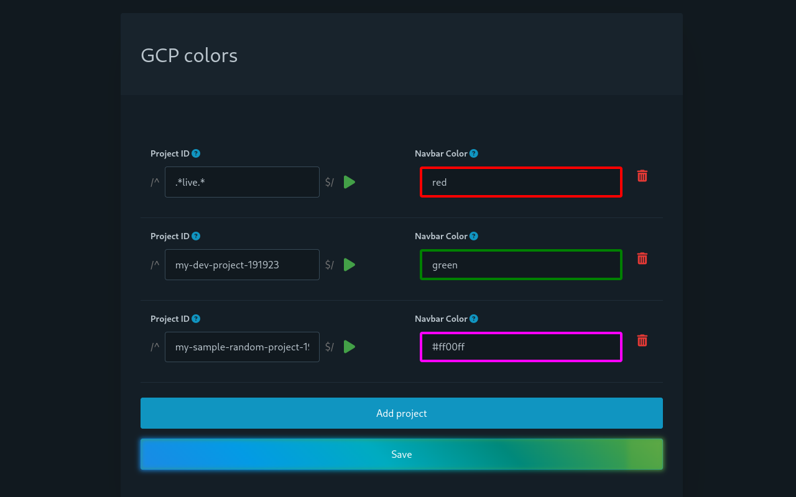
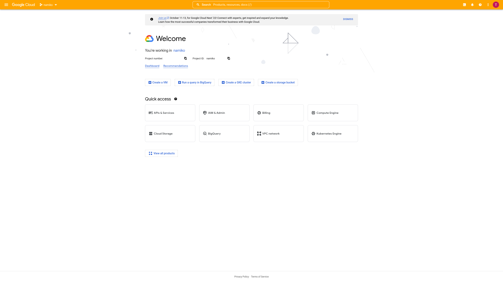
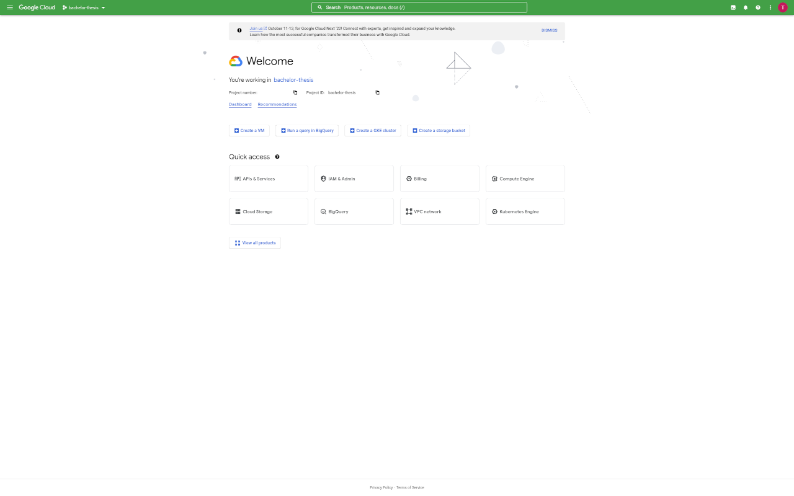

# wolkenpinsel

A tool to colorize your cloud dashboards. At the moment only the GCP console is supported.

## Development

This add-on utilizes [vue-cli-plugin-browser-extension](https://github.com/adambullmer/vue-cli-plugin-browser-extension) to build. Unfortunately the package is a bit broken atm, so this build uses a [patch](https://github.com/campfireman/vue-cli-plugin-browser-extension).

1. cd /in/to/project/folder
2. npm run install
3. npm run build

## Screenshots

## Philosophy

wolkenpinsel aspires to be [Comfy Software](https://catgirl.ai/log/comfy-software/):

- Customizability
- Keyboard-focused navigation
- Non-corporate governance
- Good documentation
- Make the common things easy
- A cute name

## Roadmap

- [ ] Make storage format more extensible
- [ ] Add validation
- [ ] Add build scripts for Firefox, Chromium and Opera
- [ ] Add CI/Pipeline for publishing
- [ ] Add rule hierarchy
- [ ] Add support for regex
- [ ] Add rule for changing the GCP Avatar
- [ ] Add selenium GUI tests
- [ ] Update logo to use colors form stylesheet
