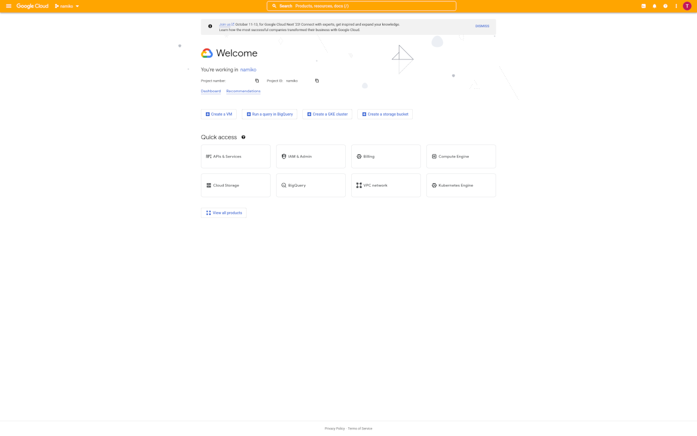

# wolkenpinsel

A tool to colorize your cloud dashboards. At the moment only the GCP console is supported.

## Development

This add-on utilizes [vue-cli-plugin-browser-extension](https://github.com/adambullmer/vue-cli-plugin-browser-extension) to build. Unfortunately the package is a bit broken atm, it might require local patching.

1. cd /in/to/project/folder
2. npm run install
3. npm run build

If build fails remove the lines 117-122 in `./node_modules/vue-cli-plugin-browser-extension/index.js`. This fixes the compatibilty issues.

## Screenshots

